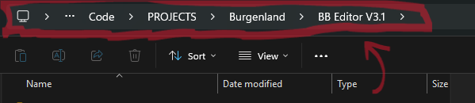
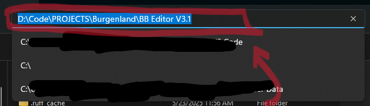

# Installation for Windows

!!! note
    **"Repo"** is short for a code repository. In this case, "repo" references a GitHub repository.

!!! note
    You will need a free, active GitHub account with access to the private BB repo. Sign up on [GitHub.com](https://github.com).

## 1. Clone or Download Code from GitHub

- browse to the private BB repo ([BB-Editor-V3-main](https://github.com/275RR/BB-Editor-V3)) on GitHub
- click the green **`Code`** button
- click **`Download ZIP`**
- unzip the code to a location of your choice on your local machine

!!! warning
    Do NOT unzip to Windows protected folders such as Documents, Favorites, Desktop, etc

## 2. Install uv (Package Manager for Python)

- open Powershell by right-clicking on Windows Start button then click Powershell or Terminal
- copy/paste the code below into Powershell and press Enter

```powershell
powershell -ExecutionPolicy ByPass -c "irm https://astral.sh/uv/install.ps1 | iex"
```

- after uv installation has finished, close powershell

## 3. Install Git

### Install Git with PowerShell script (preferred, automatic)

- using file explorer, navigate to the **`BB-Editor-V3-main`** folder that you unzipped onto your local machine
- in the BB-Editor-V3-main folder, right-click on **`install-git.ps1`** and select **`"Run with PowerShell"`**

!!! warning
    If your terminal opens and instantly closes WITHOUT your input, try one of the other Git install methods below.

- after Git installation is complete, you can close PowerShell/Terminal.

### Optional: Install Git using the Terminal to manually run the PowerShell script

1. find the full path to your **`BB-Editor-V3-main`** folder
    - using file explorer, navigate to your BB-Editor-V3-main folder
    - click the file explorer URL bar, copy the full path to your BB-Editor-V3-main folder

    { loading=lazy }

    { loading=lazy }

2. open PowerShell by right-clicking on the Windows Start button then click PowerShell or Terminal
3. paste the full path to your BB-Editor-V3-main folder into PowerShell
    - type cd followed by a space
    - paste the full path to your bb editor folder
    - put quote marks at start of full path and end of full path and press Enter
    - see example below

    ```powershell
    cd "C:\<some folder>\<another folder>\BB-Editor-V3-main"
    ```

4. copy/paste the powershell command below into the terminal and press Enter

```powershell
powershell -ExecutionPolicy ByPass .\install-git.ps1
```

### Optional: Install Git manually

- download Git installer from [Git Downloads](https://git-scm.com/install/windows)
- use default options during installation

## 4. Run BB Editor V3

- navigate to **`BB-Editor-V3-main/App/`** folder on local machine
- Double-Click **`Run BBeditor.bat`**
!!! note
    On first run, uv will install any needed packages
!!! note
    When you attempt your first Pull in the GitHub Pull tab, you should get a yellow box warning about local changes and a green box for success. This is normal.
