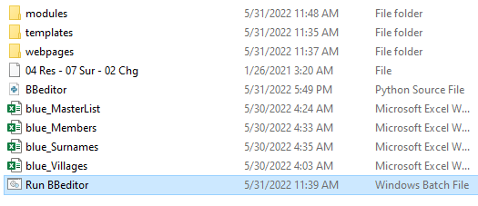
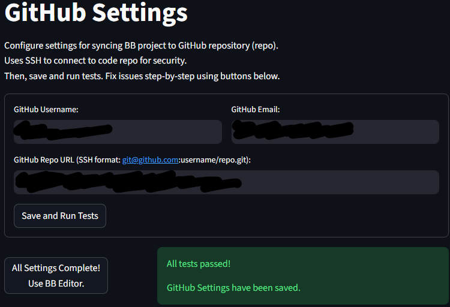
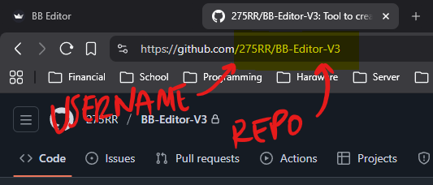
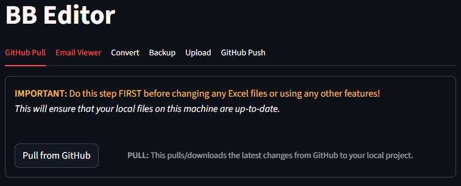
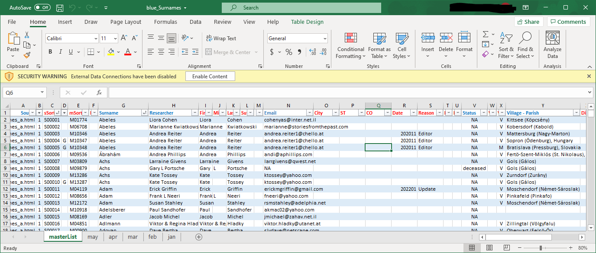
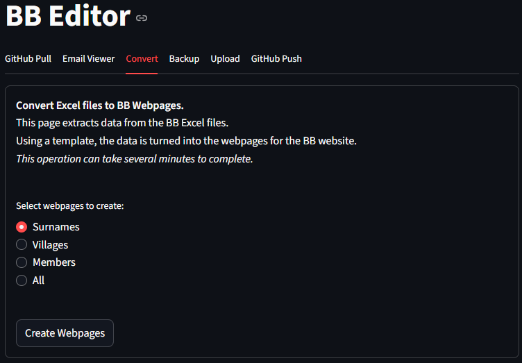
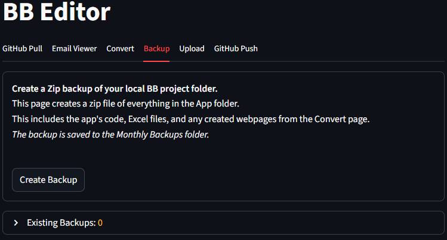
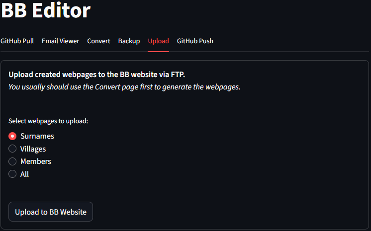
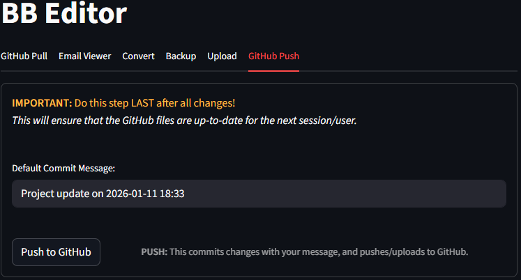

# Using BB Editor App

!!! note "Quick Start"
    This is a Quick Start guide for using the BB Editor app. See **[Editor Process](details/)** for detailed processes and workflows as an editor.

    !!! note
        The BB Editor tabs are in the order of your workflow.

    !!! warning
        GitHub Pull latest changes BEFORE making any changes to Excel, Data, or Code. After all changes using Excel or BB Editor are done, Push changes to GitHub. The App will remind you.

 

### 1. Run BBeditor.bat

{ loading=lazy }  
!!! note
    Double-click on the **`Run BBeditor.bat`** file to launch the BB Editor tool.

 

### 2. Configure BB Editor's settings

{ loading=lazy }  
!!! note
    Follow the instructions to configure all of the BB Editor's settings pages.  
    *This only needs to be completed once.*

 

{ loading=lazy }  
!!! note "Note for GitHub Settings"
    Use SSH Format to connect to this repo on GitHub:  
    `git@github.com: <REPO_USERNAME>/<REPO_NAME>.git`  
    *You could upload this code under your own GitHub account.*

 

### 3. Pull from GitHub

{ loading=lazy }  
!!! note
    Click `Pull from GitHub` on the "GitHub Pull" tab as the first step of your workflow each time.

 

### 4. Make BB edits in Excel

{ loading=lazy }  
!!! note
    Open the `Surnames and/or Villages Excel file` and make the needed changes.  
    Use "Email Viewer" tab in BB Editor to help.  
    Repeat until all changes are done.  
!!! warning
    IMPORTANT: Save and close Excel before the next step.

 

### 5. Convert Excel to webpages

{ loading=lazy }  
!!! note
    Click on the "Convert" tab, select which Excel files to convert to webpages, and click `Create Webpages`.

 

### 6. Backup edits

{ loading=lazy }  
!!! note
    Click on the "Backup" tab and click `Create Backup` to save a local copy of the project.

 

### 7. Upload new edits

{ loading=lazy }  
!!! note
    Click on the "Upload" tab, select which webpages to upload, and click `Upload to BB Website`.

 

### 8. Push to GitHub

{ loading=lazy }  
!!! note
    Click on the "GitHub Push" tab, enter a message about your changes, and click `Push to GitHub`.
